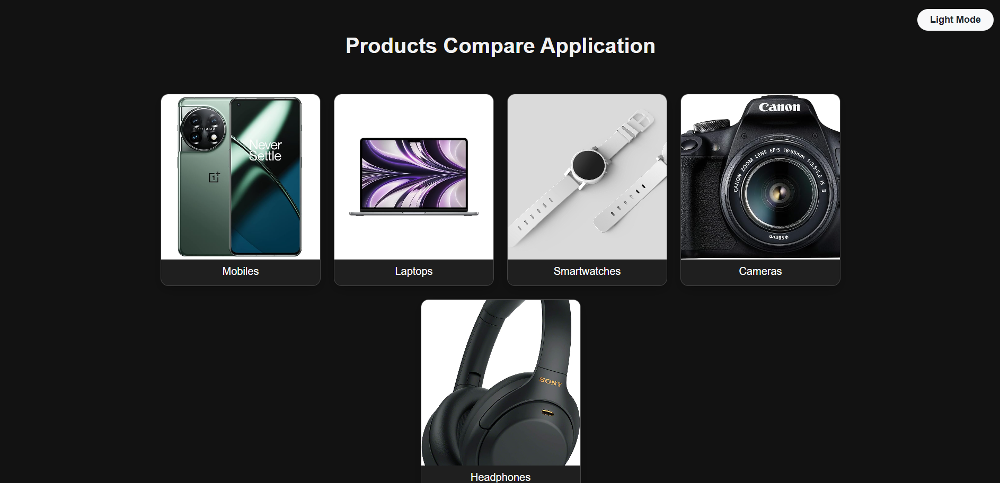

## Products Compare Application

An interactive and responsive **React** application that allows users to compare up to **three products** side-by-side. Users can browse categories like Mobiles, Laptops, Smartwatches, Cameras, and Headphones, then compare the technical specs in a sleek comparison view with support for **dark/light mode**, **search**, and **localStorage**.

## Live Demo

## GitHub Repository

[https://github.com/chethanmj0430/products-compare-application](https://github.com/chethanmj0430/products-compare-application)

## Setup Instructions

### 1. Clone the Repository

git clone https://github.com/chethanmj0430/products-compare-application.git
cd products-compare-application

### 2. Install Dependencies

Ensure you have Node.js and npm installed. Then run:

npm install

### 3. Start the Application

npm start

Visit the app in your browser:

 http://localhost:3000

##  Features

**Category Browsing**

* View products by category: Mobiles, Laptops, Smartwatches, Cameras, Headphones
* Product cards with: image, name, brand, price, and 2–3 features

**Compare View**

* Select up to 3 products to compare side-by-side
* Comparison table auto-updates with selected products
* Differences are highlighted visually (background highlight)

**Search + Filtering**

* Filter products by name or brand within each category

**Dark/Light Mode**

* Toggle UI theme using a floating button

**Responsive Design**

* Mobile and desktop friendly with flexible layouts

**LocalStorage Persistence**

* Compare list is retained across reloads

##  Assumptions

* Product data is static and stored locally (no API/backend)
* Images are sourced from Amazon public links
* Maximum of 3 products can be selected for comparison

## Screenshots 

* Home / Category View
  

* Product Grid
  

* Comparison View
  

## Tech Stack

* **Frontend**: React (with functional components and hooks)
* **Styling**: CSS3 (custom styling with responsive design)
* **Tooling**: Create React App
* **State**: useState, useEffect
* **Persistence**: localStorage

## Author

Chethan M J(https://github.com/chethanmj0430)

